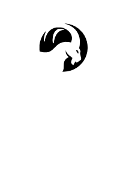

# IDM Extensions to TSKIT

## Getting Set Up Locally

**Note:** TSKIT now requires Python 3.7 or newer (does not work with Python 3.6)

1. `git clone https://github.com/clorton/tskit.git`<br>_OR_<br>`git clone git@github.com:clorton/tskit.git`
2. in the repository, `git submodule init` (because TSKIT includes KASTORE as a submodule)
3. in the repository, `git submodule update` (see above)
4. (recommended) `git remote rename origin clorton` (we will use "clorton" as the remote name in the following command)
5. `git checkout -b idm-ibx-calculations clorton/idm-ibx-calculations`
6. <font color=orange>**change to the python folder in the repository**</font>

### To Build for a Local _Install_ and Install

7. `python3 setup.py bdist_wheel`
8. `python3 -m pip install dist/<name of wheel>` (\<_name of wheel_\> depends on your Python version)

### To Build for _Development_ and Install

7. `python3 -m pip install -e .`

## Basic Usage

With a TSKIT TreeSequence (e.g. `ts = tskit.load("tree-sequence.ts"))`)...

0. `import tskit, idm`
1. get the "full genome" data for the genomes in the tree:

```python
genomes, lengths = idm.get_genomes(ts)
```

### For IB**D** Data

2. `ibd = idm.IbxResults(genomes, intervals=lengths)`
3. look up IBD for a pair of genomes, g<sub>x</sub> and g<sub>y</sub>, with `similarity = ibd[gx, gy]`

The value returned from the IbxResults lookup is the sum of the interval lengths of the intervals which the two genomes inherit from the same root. Divide this value by the total length of all the intervals* to normalize to [0.0 and 1.0].

\*e.g., `np.sum(lengths)`

Optionally, you can request the IBD for only a subset of the available genomes be calculated and returned (can save time and memory).

Asumming you have `import numpy as np` and a list of genome IDs, `ids`:

* `subset = np.asarray(ids, dtype=np.uint32)`
* `ibd = idm.IbxResults(genomes, intervals=lengths, indices=subset)`

### For IB**S** Data

Omit the `intervals` parameter to `idm.IbxResults()` and the calculation will assume each position in the genome is of length 1. You can still, optionally, provide a subset of the available genome IDs, if appropriate, to reduce both computation time and memory usage.

The value returned from the IbxResults lookup is the number of sites with matching variants. Divide this value by the total number of sites to normalize to [0.0...1.0].

## Caveats and Warnings

## "Low Level" API

* `align_data(ndarray)`  
<br>Takes a two dimensional NumPy array and returns an equivalent array which is allocated and strided so that every row of the array, e.g. array[N,:] starts on a 32-byte boundary.

* `get_genomes(treesequence)`  
<br>Takes a TSKIT TreeSequence of G genomes and I intervals and returns a two-tuple of a two dimensional NumPy array with the "full genome" data, i.e. the source root of each interval in each genome, with shape (G,I) and a one dimensional NumPy array with the intervals lengths for all I intervals.  
<br>The genome data is memory aligned to be used directly in `calculate_ibx()`.

* `calculate_ibx(genomes:ndarray, intervals:ndarray=None, indices:ndarray=None)`  
<br>Takes a two dimensional NumPy array of genome data, e.g. from `get_genomes()`, and returns an array with the similarity between pairs of genomes as calculated with IBD or IBS.  
Optionally takes `intervals` and/or `indices` parameters.  
<br>The `intervals` parameter, if passed, should be a one-dimensional NumPy array, `dtype=np.uint32`, with the lengths of the intervals in the genomes. `intervals.shape[0] == genomes.shape[1]`  
<br>The `indices` parameter, if passed, should be a one-dimensional NumPy array, `dtype=np.uint32`, with genome IDs to be considered in the calculation. Entries in `indices` should be in the range [0...G).  
<br>Returns a three tuple (thruple?) of a two dimensional NumPy array with similarity data, a list of SHA256 hash digests, and a dictionary mapping hash digests to rows/columns in the similarity data.

### Gory Details

If there happen to be a significant number of clonal copies of a genome in the TreeSequence, we can save quite a bit of time by only calculating the similarity between unique genomes. E.g., if there are, due to clonal copies, only G/2 unique genomes in the set, we can get a 4x speed up in calculation. We determine which genomes are clonal copies by calculating the SHA256 hash of each genome's data (much faster than comparing the full genomic data of the two genomes). We then only calculate the similarity between unique genomes in this reduced set of comparisons. To determine the relevant row/column in the reduced array for a given genome, g<sub>i</sub>, use the following procedure:

First, determine the SHA256 hash of g<sub>i</sub> from the list of hash digests returned from `calculate_ibx()`, e.g.:

```python
hash = hashes[gi]
```

Next, determine the index of that hash digest in the sorted, unique set of hash digests by looking it up in the mapping returned from `calculate_ibx()`, e.g. `index = mapping[hash]`

Last, look up the similarity value for the genome g<sub>i</sub> and another genome, g<sub>j</sub> in the reduced array returned from `calculate_ibx()`, e.g.:

```python
similarity = ibx[index_for_gi, indexfor_gj]
```

This can be put together for the following:

```python
similarity = ibx[mapping[hashes[i]], mapping[hashes[j]]]
```

Note that the `IbxResults` class captures the hash list and mapping returned from `calculate_ibx()` and does this look up for you so you can index the results in an instance of `IbxResults` directly with the original genome IDs: `similarity = results[i, j]`

----

Notes sent to Mandy. Could incorporate some or all of this above.

This work is based on [tskit](https://tskit.dev/tskit/docs/stable/index.html), the tree sequence toolkit. For the purposes of this documentation, a TreeSequence (the Python object tskit exposes) contains the information about a population of genomes, a defined set of intervals on each genome, e.g., three intervals at positions 1-100, 101-256, 257-1000, and the source of the genetic information for each interval on each genome, e.g., genome 4 is made up of material from root 2, root 0, and root 1, in that order for the three intervals on the genome.
 
Here are some sample trees from an actual TreeSequence (in this case, the first four intervals):


 
These trees define the following genomes (the sample trees specify 5 positions, I have only transcribed the first 4 here):

|Genome\Interval|0 (23 positions)|1 (149 positions)|2 (5 positions)|3 (82 positions)|Note|
|:-:|:-:|:-:|:-:|:-:|--|
|**0**|0|0|0|0|By definition, this is a root.
|**1**|1|1|1|1|"|
|**2**|2|2|2|2|"|
|**3**|0|0|0|0|Clonal copy of root 0|
|**4**|0|2|2|2||
|**5**|2|2|2|2|Clonal copy of root 2|
|**6**|0|0|0|0|Clonal copy of root 0|
|**7**|2|0|0|0||
|**8**|2|2|0|0||
|**9**|2|2|2|2|Clonal copy of root 2|
|**10**|0|0|0|0|Clonal copy of root 0|
|**11**|0|0|0|0|Clonal copy of root 0|
|**12**|0|0|0|1||

<br>

```python
>>> genomes, intervals = idm.get_genomes(ts)
>>> genomes
array([[0, 0, 0, 0],
       [1, 1, 1, 1],
       [2, 2, 2, 2],
       [0, 0, 0, 0],
       [0, 2, 2, 2],
       [2, 2, 2, 2],
       [0, 0, 0, 0],
       [2, 0, 0, 0],
       [2, 2, 0, 0],
       [2, 2, 2, 2],
       [0, 0, 0, 0],
       [0, 0, 0, 0],
       [0, 0, 0, 1]], dtype=uint16)
>>> intervals
array([ 23, 149,   5,  82], dtype=uint32)
>>>
```

<br>

Now it starts to get a little more interesting...

We want to calculate IBD (identity by descent) or IBS (identity by state) - the similarity of two genomes either by the number of intervals in their genomes that come from the same root (IBD) or the number sites where they have the same allele/variant regardless of its source (IBS).

So the brute force method is to compare the data of all pairs of genomes in the tree - an N^2 operation.

Note that in the genomes output above, there are actually only 7 unique genomes (0, 1, 2, 4, 7, 8, and 12) since (3, 5, 6, 9, 10, and 11) are clonal copies of (root) 0 or (root) 2. So there are only 42 unique pairings (7x6) to calculate rather than 156 (13x12) a significant savings. Even more so when dealing with 24k genomes (~576,000,000 pairs) but only 6k unique (~36,000,000) or 86k genomes (~7,396,000,000) and only 24k unique (~576,000,000). But...how do we find clonal copies without comparing them against all the other genomes - exactly the computation we want to avoid?

The solution is to calculate the SHA256 hash of each genome - a very fast operation. We get something like this:

|Genome|SHA256 Hash\*|
|:-:|:-:|
|0|<font color="red">af5570f5</font>|
|1|efef8d5a|
|2|<font color="blue">7d1ad619</font>|
|3|<font color="red">af5570f5</font>|
|4|02a4219c|
|5|<font color="blue">7d1ad619</font>|
|6|<font color="red">af5570f5</font>|
|7|d86e8112|
|8|444b26b3|
|9|<font color="blue">7d1ad619</font>|
|10|<font color="red">af5570f5</font>|
|11|<font color="red">af5570f5</font>|
|12|30e06038|

*Actual hash values are 64-characters: af5570f5a1810b7af78caf4bc70a660f0df51e42baf91d4de5b2328de0e83dfc
 
Note that the same values show up in the genomes that have the same data. We then take the set of unique hash values and sort it in order to be able to recreate this configuration if necessary:

||
|:-:|
|02a4219c|
|30e06038|
|444b26b3|
|7d1ad619|
|af5570f5|
|d86e8112|
|efef8d5a|

Now we only calculate the similarity score for these unique pairs of hash values:

||0 (02a4219c)|1 (30e06038)|2 (444b26b3)|3 (7d1ad619)|4 (af5570f5)|5 (d86e8112)|6 (efef8d5a)|
|:-:|:-:|:-:|:-:|:-:|:-:|:-:|:-:|
|0 (02a4219c)|259|23|149|236|23|0|0|
|1 (30e06038)|23|259|5|0|177|154|82|
|2 (444b26b3)|149|5|259|172|87|110|0|
|3 (7d1ad619)|236|0|172|259|0|23|0|
|4 (af5570f5)|23|177|87|0|259|236|0|
|5 (d86e8112)|0|154|110|23|236|259|0|
|6 (efef8d5a)|0|82|0|0|0|0|259|

Note that any hash compared with itself has a perfect value - 259 (the sum of the interval lengths, 23 + 149 + 5 + 82, in this instance) because all intervals match.

So, how do we determine the similarity of two genomes from the original set? Lets consider genomes 8 and 9.

Genome 8 is a recombination of roots 2 and 0: 2, 2, 0, 0.  
Genome 9 is a clonal copy of root 2: 2, 2, 2, 2.  
These two genomes match at the first and second interval or for 172 positions (23 for the first and 149 for the second).

We use the list of hashes to get the hash for genome 8 - 444b26b3 - and for genome 9 - 7d1ad619 - then we find the position of these hashes in the sorted set of unique hashes, indices 2 and 3 respectively, and look up the similarity score in position [2,3] and get 172 - excellent! Note, of course, the matrix is symmetric across the diagonal.

```python
import tskit, idm

# Load a tskit TreeSequence from disk
sequence = tskit.load(filename)

# Get the 2D genome data array and 1D intervals lengths vector
genomes, intervals = idm.get_genomes(sequence)

# Calculate the similarity between the genomes
# ibx is the 2D array of similarity between unique hash values
# hashes is the 1:1 list of hash values for the genomes
# mapping is the map from a hash value to its place in the sorted list of unique hash values
ibx, hashes, mapping = idm.calculate_ibx(genomes, intervals=intervals)

# Get the similarity (IBD) score for genomes 8 and 9
score = ibx[mapping[hashes[8]], mapping[hashes[9]]]
```

## IbxResult

The contortions to get the similarity score for two genomes are a hassle so there is a helper class `IbxResults` which calls `idm.calculate_ibx()`, caches the data, hashes, and hash mapping it returns, and supports an indexing operator, `[a, b]`, which does all of the above and returns the similarity score for the given genome IDs.

```python
class IbxResults:

    def __init__(self, genome, indices=None, intervals=None):
        """caches the inputs, calls idm_calculate_ibx(), and captures the outputs"""
        return

    @property
    def genome(self):
        """The input genome, for reference"""
        return self._genome

    @property
    def indices(self):
        """The input set of indices, for reference"""
        return self._indices

    @property
    def intervals(self):
        """The input set of intervals, for reference"""
        return self._intervals

    @property
    def pairs(self):
        """The similarity scores, by hash, from calculate_ibx()"""
        return self._ibx

    @property
    def hashes(self):
        """The genome hashes from calculate_ibx()"""
        return self._hashes

    @property
    def mapping(self):
        """The hash->index mapping from calculate_ibx()"""
        return self._mapping

    def __getitem__(self, key):
        """Return the similarity score for two genomes."""
        if isinstance(key, slice):
            ida, idb = key.start, key.stop
        else:   # tuple
            ida, idb = key

        indexa = np.where(self._indices == ida)[0][0]
        indexb = np.where(self._indices == idb)[0][0]

        hasha = self._hashes[indexa]
        hashb = self._hashes[indexb]
        ibxa = self._mapping[hasha]
        ibxb = self._mapping[hashb]

        return self._ibx[ibxa, ibxb]
```

The code from above but using `IbxResults` looks very similar but slightly more straightforward:

```python
import tskit, idm

# Load a tskit TreeSequence from disk
sequence = tskit.load(filename)

# Get the 2D genome data array and 1D intervals lengths vector
genomes, intervals = idm.get_genomes(sequence)

# Use IbxResults to easily retrieve similarity scores
results = idm.IbxResults(genomes, intervals=intervals)

# Get the similarity (IBD) score for genomes 8 and 9
score = results[8, 9]
```

## IBD vs. IBS

For IBD calculations, the genome data is the root from which each interval came and the length of that interval in base pairs. The IBD value for two genomes is the number of base pairs they have in common _due to the source of those pairs_.

Most of the information presented above is describing the IBD calculation.

For IBS calculations, the genome data is the allele at each site for the genome and the interval is assumed to be 1. The IBS value for two genomes is the number of sites where the two genomes have the same allele _regardless of source_ (i.e. mutation or from an unknown common ancestor).

### IBS Example

Suppose we have genomic data for 6 sites and we observe 2-5 variants/alleles at each sites like this:

|Site|Variants/Alleles|
|:-:|:-:|
|0:|['A0', 'A1']|
|1:|['B0', 'B1', 'B2', 'B3']|
|2:|['C0', 'C1', 'C2']|
|3:|['D0', 'D1', 'D2', 'D3', 'D4']|
|4:|['E0', 'E1', 'E2']|
|5:|['F0', 'F1', 'F2', 'F3']|

Given some samples:

|Sample|Genome|
|:-:|-|
|0:|['A0', 'B3', 'C0', 'D1', 'E2', 'F2']|
|1:|['A1', 'B3', 'C2', 'D0', 'E2', 'F2']|
|2:|['A0', 'B3', 'C0', 'D4', 'E0', 'F2']|
|3:|['A1', 'B3', 'C1', 'D3', 'E0', 'F3']|
|4:|['A1', 'B2', 'C0', 'D0', 'E1', 'F0']|
|5:|['A0', 'B2', 'C1', 'D0', 'E0', 'F2']|
|6:|['A1', 'B1', 'C2', 'D3', 'E1', 'F3']|
|7:|['A1', 'B3', 'C0', 'D0', 'E1', 'F1']|

We encode this with the allele index in each position:

|Sample|Variant/Allele Indices|
|:-:|-|
|0:|[0 3 0 1 2 2]|
|1:|[1 3 2 0 2 2]|
|2:|[0 3 0 4 0 2]|
|3:|[1 3 1 3 0 3]|
|4:|[1 2 0 0 1 0]|
|5:|[0 2 1 0 0 2]|
|6:|[1 1 2 3 1 3]|
|7:|[1 3 0 0 1 1]|

Using this set of genome values with `IbxResults` and omitting the intervals parameter (this implicitly sets the length of each interval to 1) we get an _IBS_ calculation. E.g., genomes 0 and 2 match in 4 of 6 sites or genomes 3 and 7 match in 2 of 6 sites.

```python
by_sites = np.asarray([[0, 3, 0, 1, 2, 2],
                       [1, 3, 2, 0, 2, 2],
                       [0, 3, 0, 4, 0, 2], 
                       [1, 3, 1, 3, 0, 3], 
                       [1, 2, 0, 0, 1, 0], 
                       [0, 2, 1, 0, 0, 2], 
                       [1, 1, 2, 3, 1, 3], 
                       [1, 3, 0, 0, 1, 1]], dtype=np.uint32)

# Make sure data is aligned correctly
by_sites = idm.align_data(by_sites)

# Calculate IBS by using default interval length == 1
results = idm.IbxResults(by_sites)

results[0, 2]   # Returns 4
results[3, 7]   # Returns 2
```

